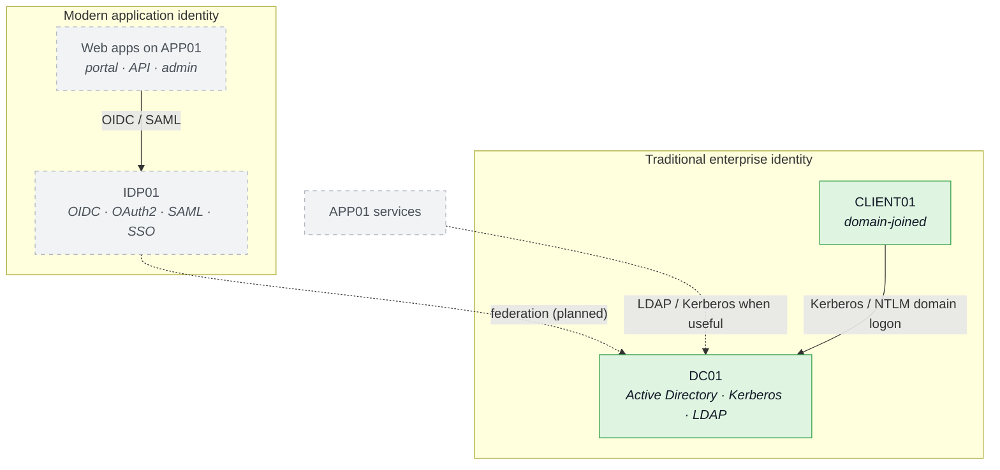

# Identity

The **authentication / trust graph** — who proves identity to whom. Separate
from the [[Overview]] network map and the [[Attack Paths]] attack graph, per the
project rule that these are different graphs.

Two identity worlds meet here: traditional Windows enterprise identity (AD on
`DC01`) and modern application identity (`IDP01`). Solid = built; dashed =
planned.

## Notes

- **AD is not just a login server.** It carries users, groups, authorization,
  domain policy, and the trust edges that make privilege escalation and lateral
  movement possible — that is why it is core.
- **DNS split**: `clayface.local` is authoritative on `DC01`; everything else
  forwards to OPNsense. The `.clayface` DNS domain (VM discovery) is owned by
  the OPNsense image and is a *separate* thing from the `clayface.local` AD
  forest. See CLAUDE.md for the exact chain.
- **IDP01 ↔ AD federation** is planned, not built — it is what will let web
  apps ride enterprise identity and open the web → IDP → AD path.
