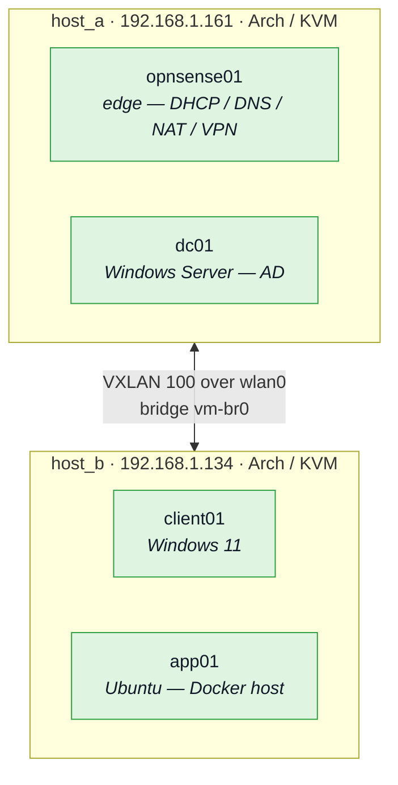
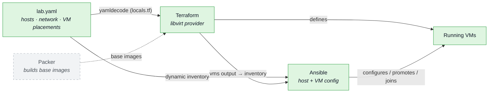

# Infrastructure

The physical + IaC layer — the hypervisor substrate and the toolchain that
provisions everything drawn in [[Overview]]. This is the IaC side objective of
the project.

## Physical + overlay

VMs are distributed across two hypervisor hosts and joined into a single
Layer 2 network by a VXLAN overlay, so placement is a scheduling decision
rather than a network one: any VM can sit on any host and still share the lab
LAN.

> [!note] Edge placement
> The gateway VM is pinned to whichever host `edge.host` names in `lab.yaml`
> — exactly one host holds it. Everything else is free to move between hosts
> by changing one line in the placement map.

## IaC toolchain

How a change flows from a single edit to running infrastructure. `lab.yaml` is
the single source of truth for static facts.

- **Terraform** reads `lab.yaml`, builds VMs via the `dmacvicar/libvirt`
  provider, and emits a `vms` output that becomes Ansible's inventory.
- **Ansible** configures the hypervisors (bridge + VXLAN), starts VMs, promotes
  `dc01` to the forest, and joins `client01`.
- **Packer** will build the Windows and Linux base images that Terraform clones
  as backing files. Images are hand-built today (`base-image/README.md`).
- `deploy.sh` wraps the whole flow (terraform apply → ansible playbooks).
