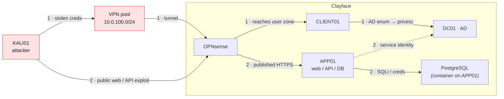

# Attack Paths

Attacker movement through Clayface — the **attack graph**, kept separate from
the [[Overview]] network map and the [[Identity]] trust graph on purpose. Every
chain starts at the attacker (`KALI01`) and is numbered; dashed = not built /
exercised yet.

## Chains

1. **Credential → VPN → workstation → AD**
   Stolen employee creds get a VPN foothold, land on `CLIENT01`, then AD
   enumeration and privilege escalation against `DC01`. Primary path.
2. **Public web → APP01 → database / AD**
   Exploit a published web/API container on `APP01`, pivot to `PostgreSQL`
   for stored credentials, and where a service identity exists, on toward AD.

Both paths converge on **AD as the crown jewel** — the point the whole lab is
built to demonstrate.

## Not yet exercised

`FILE01` SMB/NTLM relay, `CA01` AD CS abuse, `DC02` replication attacks, and
web → `IDP01` → AD are planned once those optional modules exist. See the
optional-modules list in the knowledge base.
