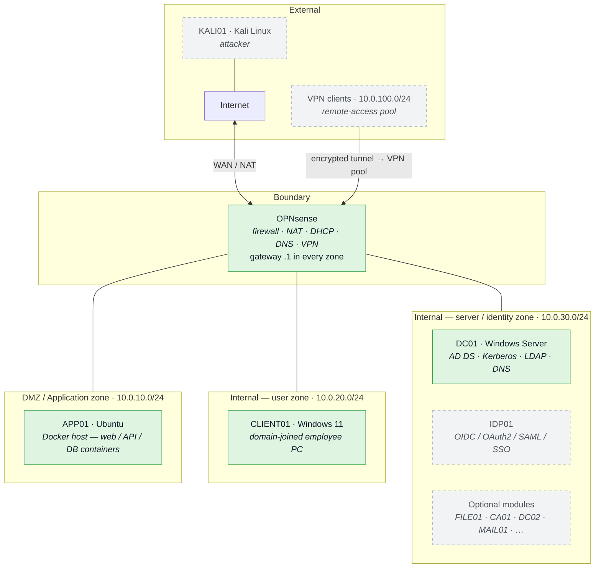

# Clayface — Overview

Clayface is an IaC-provisioned virtual corporate network with intentional,
documented misconfigurations, built for practicing the ethical-hacking
lifecycle (initial access, privilege escalation, lateral movement, data
exposure).

This page is the **network / zone map** only — the one-glance picture of what
sits where. It deliberately shows *no* attack arrows and *no* service
internals, because those are different graphs and mixing them is what makes a
diagram unreadable. See instead:

- [[Attack Paths]] — how an attacker moves through the lab.
- [[Identity]] — AD / IDP authentication and trust.
- [[Infrastructure]] — the physical hosts and the IaC toolchain that builds all this.

## Target network (zones)

Solid boxes are **built today**; dashed boxes are **planned** (this diagram is
the target vision — we are mid-development).



> [!note] Four segments
> Matches the proposal's four zones: internet-facing, DMZ, internal **user**,
> and internal **server / data-center**. Splitting user from server is what
> makes the lateral-movement story (`CLIENT01 → DC01`) legible.

### What is real and what is not

The diagram is the **target**. Two of its four zones exist; the internal split
does not, and neither does the VPN.

| Diagram element | Reality |
| --- | --- |
| DMZ `10.0.10.0/24`, APP01 `.10` | **Built.** APP01 is at `10.0.10.10` on `vm-dmz0`, behind a default-deny OPNsense boundary. The one deliberate allowance is APP01 → DC01 on LDAP. |
| Internal user / server split (`10.0.20.0/24` / `10.0.30.0/24`) | **Not built.** DC01 and CLIENT01 share one flat internal segment, `10.0.0.0/24` on `vm-lan0` — the LAN the diagram does not draw. |
| VPN pool `10.0.100.0/24` | **Declared, not implemented.** No VPN server exists (`lab.yaml` says `server: none`) and nothing answers on the range. |
| KALI01, OPT, IDP01 | **Not built.** |

### Target addressing

| Zone | Subnet | Gateway | Key hosts |
| --- | --- | --- | --- |
| DMZ / application | `10.0.10.0/24` | `.1` (OPNsense) | APP01 `.10` |
| Internal — user | `10.0.20.0/24` | `.1` (OPNsense) | CLIENT01 `.20` |
| Internal — server / identity | `10.0.30.0/24` | `.1` (OPNsense) | DC01 `.10`, IDP01 `.20` |
| VPN remote-access pool | `10.0.100.0/24` | OPNsense tunnel endpoint | assigned per client |
| WAN | upstream / NAT | — | OPNsense |

Segmentation is enforced at OPNsense: the VPN pool and the DMZ each reach the
internal zones only through explicit firewall rules, which is what makes
"attacker starts with no internal trust" a real constraint rather than a claim.

**The DMZ half of that sentence is now true**; the VPN half is not, because
there is no VPN. The DMZ boundary is five pass rules (LDAP to DC01, DNS, DHCP,
and internal users in on 443) plus two logged denies, declared as data in
`lab.yaml` and applied by `ansible/playbooks/opnsense_dmz.yml`.

Addresses above are the target scheme. What runs today: the DMZ at
`10.0.10.0/24` on `vm-dmz0` (real, matching the diagram) and one flat internal
LAN at `10.0.0.0/24` on `vm-lan0` (the diagram's two internal zones collapsed
into one). `host_b` is commented out, so the lab is single-host. See
[[Infrastructure]].

## Target stack

Conceptual build stack — the layered vision, not current state. Packer and the
SIEM layer are **not built yet**.

```
Physical machines
└── KVM / libvirt — hypervisor layer                 [built]
    └── Terraform — provisions the VMs               [built]
        └── Packer — will build the base images      [planned; images hand-built today]
            └── Ansible — configures AD, users, misconfigs   [built for AD/client]
                └── AD environment with intentional weaknesses
                    ├── Kerberoastable service accounts
                    ├── Misconfigured ACLs
                    ├── NTLM relay opportunities
                    └── …
                        └── Attack this using a C2 + tooling         [planned]
                            └── Wazuh / SIEM shows what got detected  [planned]
```

See [[Infrastructure]] for the real, current physical + IaC layer.
